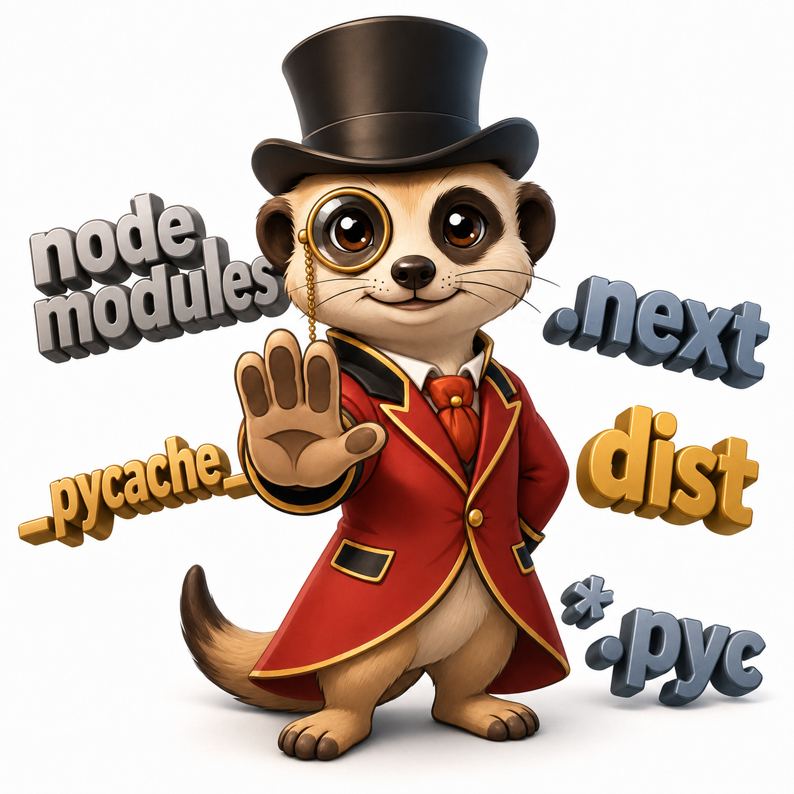

<div align="center">
  
  <h1>my-token-scrooge</h1>
  <p><strong>Stop AI coding agents from eating your context.</strong></p>
  <p>A local, deterministic context firewall for AI coding harnesses.</p>
  <p>
    
    
    
    
  </p>
</div>

> [!IMPORTANT]
> **Preview:** Codex CLI is the only locally verified integration today. Claude
> Code CLI and Google Antigravity CLI have native `PreToolUse` hook installation,
> but remain **UNVERIFIED / SHADOW**. Claude 2.1.197 is installed but organization
> policy disables its subscription access; `agy` is unavailable. Every other
> harness listed below remains planned.

AI agents often read generated bundles, dependency trees, caches, minified
files, and raw logs that are much larger than the useful answer. MTS evaluates
tool calls before execution, blocks unsafe operations, replaces expensive reads
with bounded results, and explains why retrying the blocked operation would
waste context.

## What it does

| Boundary | MTS behavior | Agent outcome |
|---|---|---|
| Unsafe edit | **FULL BLOCK** | File remains unchanged |
| Expensive read | **PARTIAL BLOCK** | Original read is denied; bounded content is returned |
| Ordinary operation | **ALLOW** | Tool call proceeds normally |
| Equivalent retry | Retry circuit | Repeated workarounds are stopped after the budget |

The agent receives actionable guidance with every blocked result:

```text
MTS guidance: Search dependencies without loading the full tree.
This policy avoids loading more context than necessary.
Do not retry or work around this block; use the bounded result below.
```

MTS runs locally, stores policies as physical UTF-8 text files, and sends no
telemetry.

## Measured evidence

Measured with the release binary at the real Codex `PreToolUse` boundary on
Windows x64:

| Scenario | Without MTS | ENFORCE result | Context delivered | Estimated tokens avoided |
|---|---:|---|---:|---:|
| `node_modules` read | 1,048,576 B | PARTIAL BLOCK | 511 B | 262,016 |
| `__pycache__` read | 524,288 B | FULL BLOCK | 185 B | 131,025 |
| `.git/objects` read | 524,288 B | FULL BLOCK | 182 B | 131,026 |
| `node_modules` edit | Mutated | FULL BLOCK | Unchanged | — |
| `dist` edit | Mutated | FULL BLOCK | Unchanged | — |

Protected reads fell from **2,097,152 B to 878 B (99.96%)**. The conservative
four-bytes-per-token estimate is **524,067 tokens avoided**, and protected edits
were prevented **2/2**. These are low-confidence byte-based estimates, not API
billing measurements. See the [sanitized benchmark summary](docs/benchmark-summary.md).

## Installation

Signed preview binaries and their verification bundles are available in the
[v0.1.0 GitHub release](https://github.com/Aminoragit/my-token-scrooge/releases/tag/v0.1.0).
The npm packages are not published yet. See the
[publishing guide](docs/publishing.md) for signature verification, or build
from a cloned checkout with Rust 1.85 or later.

### macOS and Linux

```bash
cargo build --release --bin mts
export PATH="$(pwd)/target/release:$PATH"

mts setup --targets codex-cli,claude-code-cli,antigravity-cli --yes
mts doctor
mts mode warn
mts mode enforce
mts
```

### Windows PowerShell

```powershell
cargo build --release --bin mts
$env:Path = "$(Resolve-Path .\target\release);$env:Path"

mts setup --targets codex-cli,claude-code-cli,antigravity-cli --yes
mts doctor
mts mode warn
mts mode enforce
mts
```

Setup merges one MTS-owned `PreToolUse` handler into each selected harness
configuration while preserving existing handlers:

| Target | Command | User configuration |
|---|---|---|
| `codex-cli` | `codex` | `~/.codex/hooks.json` |
| `claude-code-cli` | `claude` | `~/.claude/settings.json` |
| `antigravity-cli` | `agy` | `~/.gemini/config/hooks.json` |

`mts uninstall --targets codex-cli,claude-code-cli,antigravity-cli` removes only
the MTS-owned handlers. New installations start in `SHADOW` mode.

## Policies

MTS intentionally exposes only two policy types:

```text
# FULL BLOCK: never execute the original operation
node_modules/** | write,edit | Installed dependencies must not be modified directly

# PARTIAL BLOCK: deny the original operation and return bounded context
**/*.log | read | errors-only | max_matches=100,before=3,after=8 | Return error regions only
```

Presets cover dependency trees, Python caches, Git object storage, generated
build output, logs, minified JavaScript, and unusually large reads. Project
overrides can live in an optional `.mts/` directory.

## Harness support

### Available now — native hook installation

| Harness | Native boundary | Configuration | Status |
|---|---|---|---|
| **OpenAI Codex CLI** (`codex-cli`) | `PreToolUse`: shell reads and `apply_patch` | `~/.codex/hooks.json` | Locally verified preview: Codex CLI 0.144.1, Windows x64 |
| **Anthropic Claude Code CLI** (`claude-code-cli`) | `PreToolUse` | `~/.claude/settings.json` | Implemented; UNVERIFIED / SHADOW (2.1.197 installed, execution disabled by organization policy) |
| **Google Antigravity CLI** (`antigravity-cli`, command `agy`) | `PreToolUse` | `~/.gemini/config/hooks.json` | Implemented; UNVERIFIED / SHADOW (`agy` unavailable on test PC) |

Only the Codex row is a live-verification claim. This is not a GA or
cross-platform support claim. New installations start in `SHADOW`; use
`mts doctor` before promotion.

### Planned — not supported yet

| Integration group | Planned harnesses | Current status |
|---|---|---|
| Native hooks | `claude-code-vscode`, `claude-code-jetbrains`, `codex-vscode`, `gemini-cli`, `qwen-code-cli`, `copilot-cli` | UNVERIFIED / SHADOW |
| Plugins and ACP | `opencode-cli`, `goose-cli`, `goose-desktop`, `gptme-cli`, `gptme-acp`, `hermes-cli`, `qwen-code-acp`, `openclaw`, `kimi-code-cli`, `kimi-code-vscode`, `zed-agent-panel`, `jetbrains-acp` | UNVERIFIED / SHADOW |
| Middleware and sandboxes | `cline-cli`, `cline-vscode`, `cline-jetbrains`, `hermes-gateway`, `openhands-local`, `continue-cli`, `continue-ide`, `open-interpreter`, `auto-code-rover`, `smol-developer`, `swe-agent` | UNVERIFIED / SHADOW |
| Wrappers and custom commands | `aider`, `plandex`, `gpt-pilot`, `codebuff`, `freebuff`, `crush`, `amazon-q-cli`, `rovo-dev-cli`, `amp-cli`, `factory-droid-cli`, `pi-coding-agent`, `mentat`, `warp-agent`, `custom-command` | UNVERIFIED / SHADOW |
| IDE, repository, and advisory surfaces | `cursor-ide`, `cursor-background`, `windsurf-cascade`, `roo-code`, `kilo-code`, `jetbrains-junie`, `copilot-vscode-agent`, `amazon-q-ide`, `kiro-ide`, `sourcegraph-cody`, `augment-code`, `refact-ai`, `tabby`, `void-editor`, `pearai`, `trae`, `codebuddy`, `blackbox-ai` | UNVERIFIED / SHADOW |

Registry entries describe planned integration ceilings, not current support.
See the complete generated [64-target support matrix](docs/support-matrix.md).

## How it works

```text
Harness tool call
      │
      ▼
MTS pre-tool hook ──► normalize intent ──► evaluate physical policy
      │                                      │
      ├── ALLOW ─────────────────────────────┘
      ├── FULL BLOCK ──► deny + explain
      └── PARTIAL BLOCK ► deny + bounded result + no-retry guidance
```

Savings are recorded locally as protected bytes, avoided output, replacement
output, retry overhead, and conservative estimated net tokens.

## Development

```bash
cargo fmt --all --check
cargo clippy --workspace --all-targets -- -D warnings
cargo test --workspace
npm test
npm run pack:check
node scripts/english-gate.mjs
node adapters/validate.mjs
npm run support:check
```

The canonical product interfaces are English-only. See [SECURITY.md](SECURITY.md)
for private vulnerability reporting and [release readiness](docs/release-readiness.md)
for the remaining GA evidence. Maintainers should follow the
[signed release and npm publishing guide](docs/publishing.md).

## License

MIT © my-token-scrooge contributors
